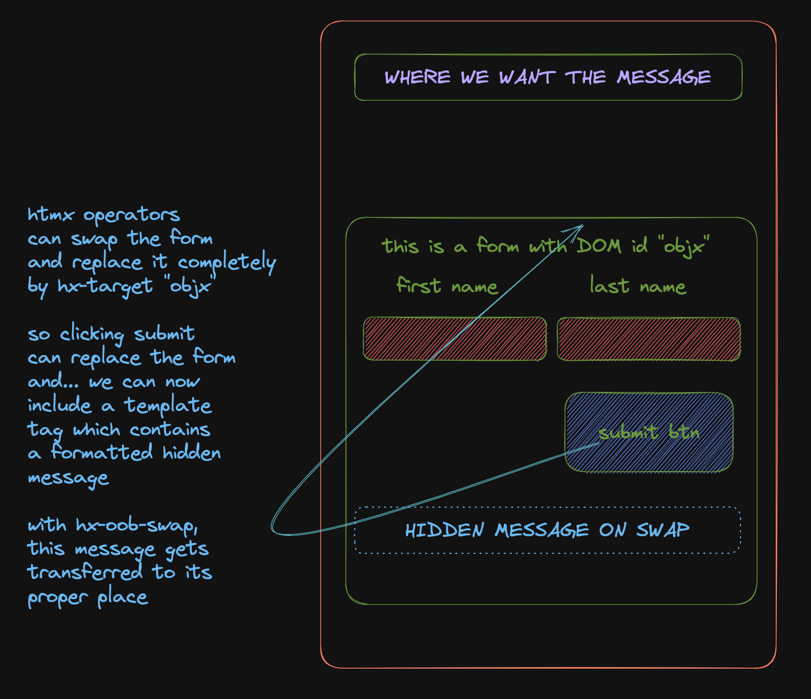

# ``

## Concept

This adopts the architecure for messages in [django-fragments](https://justmars.github.io/django-fragments)' `msg.html` to create a global alerts center so that [hyperscripted](https://hyperscript.org)-notifications can be added after an [htmx](https://htmx.org) swap.

```jinja title="Invocation" linenums="1" hl_lines="1 3"
 {# (1) #}

   {# (2) #}

```

1. Custom template tag from the "pages" app. See `src/pages/templatetags`.
2. Assuming template fragment of `HttpResponse` contains a `form`, I can isolate `non_field_errors` to render them as messages.

## Implementation



## Django Messages As Alerts

### Messages: from htmx swaps

Because of the global alerts center, messages can be displayed whenever they are included in general request-response cycle.

However outside this general full page cycle, the template will lack context when only parts of the DOM are modified.

In such cases, I need to add a helper template tag `` so that I can use `hx-swap-oob` to modify the template on swap. See discussion on _Messages, Post Swap_.
