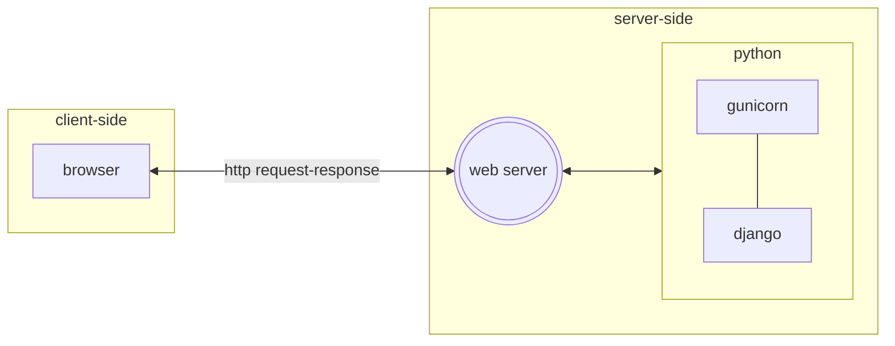
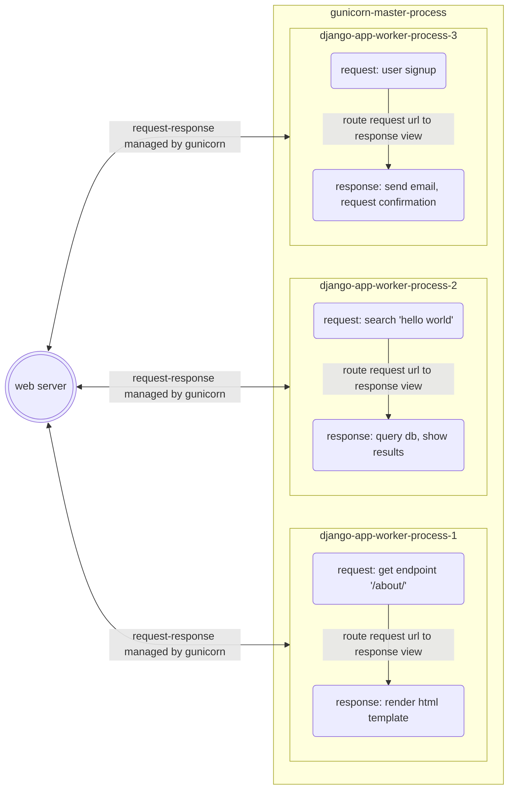

# Web Server

## Overview

!!! warning "tl;dr: Runserver v. Gunicorn"

    The `runserver` management command, producing the URL _http://127.0.0.1:8000/_, is useful only in _local development_ environments. Gunicorn, for synchronous operations, is more suited for _production_ environments.

What is a web server? _Testdriven.io_ makes a colorful introduction to the [concept](https://testdriven.io/courses/python-web-framework/wsgi/):

> Imagine for a moment that you are a web server, like Gunicorn. Your job consists of the following parts:
>
> - You sit around and wait patiently for a request from some kind of a client.
> - When a client comes to you with a request, you receive it.
> - Then, you take this request to someone called PythonApp and say to him, "Hey dude, wake up! Here's a request from a very important client. Please, do something about it."
> - You get a response from this PythonApp.
> - You then deliver this response back to your client.
>
> This is the only thing you do. You just serve your clients. You know nothing about the content or anything else. That's why you are so good at it. You can even scale up and down processing depending on the demand from the clients. You are focused on this single task.

More specifically, _gunicorn_ is a WSGI - a web server _gateway interface_; a web server would be something like _nginx_. And this _gateway interface_ is what python apps like Django/Flask _interface with_ to reach the actual web server:

```toml title="pyproject.toml include's gunicorn" linenums="1" hl_lines="4"
[tool.poetry.dependencies]
python = "^3.11.3"
django = {version = "^4.2.1", allow-prereleases = true}
gunicorn = "^20.1"
...
```

How I presently understand the relationship:



Gunicorn receives requests and processes it through  workers. Based on its [docs](https://docs.gunicorn.org/en/latest/design.html#server-model):

> Gunicorn is based on the pre-fork worker model. This means that there is a central master process that manages a set of worker processes. The master never knows anything about individual clients. All requests and responses are handled completely by worker processes.

Concretizing this description, I create this visual, mental model:



## Runserver using config.wsgi

How is `runserver` related to `config.wsgi`?

According to :simple-django: [docs](https://docs.djangoproject.com/en/4.2/ref/django-admin/#runserver):

> _runserver_: ... This server uses the WSGI application object specified by the `WSGI_APPLICATION` setting.

And in our settings, we see that

```py title="config/settings/_settings.py"
WSGI_APPLICATION = "config.wsgi.application"
```

## Gunicorn using config.wsgi

!!! warning "Async"

    Lately, Django's interest has veered towards ASGI - _asynchronous_ server gateway interface - as well. See Mariusz Felisiak's initial take on this in [Running Tasks Concurrently in Django Asynchronous Views](https://fly.io/blog/running-tasks-concurrently-in-django-asynchronous-views/).  This boilerplate implementation is limited to the synchronous processes.

`gunicorn` replaces the built-in `python manage.py runserver` since the latter should __NOT__ run in production. Django's warning is [explicit](https://docs.djangoproject.com/en/dev/ref/django-admin/#runserver):

   > _runserver_: ... DO NOT USE THIS SERVER IN A PRODUCTION SETTING. It has not gone through security audits or performance tests. (And that’s how it’s gonna stay. We’re in the business of making web frameworks, not web servers, so improving this server to be able to handle a production environment is outside the scope of Django.)

The gunicorn docs contains a specific section on how it integrates with [Django](https://docs.gunicorn.org/en/latest/run.html#django):

> Gunicorn will look for a WSGI callable named `application` if not specified. So for a typical Django project, invoking Gunicorn would look like:
>
> $ `gunicorn myproject.wsgi`

```zsh title="scripts/web.sh" linenums="1" hl_lines="2"
gunicorn config.wsgi:application \
    --bind 0.0.0.0:"$PORT" \  # (1)
    --workers=2 \ # (2)
    --worker-tmp-dir /dev/shm \ # (3)
    --capture-output \
    --enable-stdio-inheritance
```

1. Instead of running the server in address `127.0.0.1` with port `8000`; we use `--bind 0.0.0.0` to an environment variable `PORT`. Why `0.0.0.0`? Itamar Turner-Trauring explains this in relation to Docker [here](https://pythonspeed.com/articles/docker-connection-refused/) and concludes with `0.0.0.0` means _"listen on all interfaces"_.

2. The most relevant setting affects the app's scalability are the _type_ and _number_ of workers.

      Re: type of worker, Gunicorn docs [state](https://docs.gunicorn.org/en/latest/design.html#sync-workers):

      > The most basic and the default worker type is a synchronous worker class that handles a single request at a time. This model is the simplest to reason about as any errors will affect at most a single request. Though as we describe below only processing a single request at a time requires some assumptions about how applications are programmed.
      >
      > `sync` worker does not support persistent connections - each connection is closed after response has been sent (even if you manually add Keep-Alive or Connection: keep-alive header in your application).

      Re: number of workers, Gunicorn docs [warn](https://docs.gunicorn.org/en/latest/design.html#how-many-workers):

      > DO NOT scale the number of workers to the number of clients you expect to have. Gunicorn should only need 4-12 worker processes to handle hundreds or thousands of requests per second.

3. Helps avoid blocking requests. See gunicorn [docs](https://docs.gunicorn.org/en/latest/faq.html?highlight=dev%20%2F%20shm#how-do-i-avoid-gunicorn-excessively-blocking-in-os-fchmod) and Itamar Turner-Trauring's [notes](https://pythonspeed.com/articles/gunicorn-in-docker/).

Re: `config.wsgi:application`.

We know, by now, that _config_ refers to the project folder. The _config_ folder contains a `wsgi.py` file. This was originally created when running `django-admin startproject config`. This `wsgi.py` file refers to an `application`:

```py title="/config/wsgi.py" linenums="1" hl_lines="5"
import os
from django.core.wsgi import get_wsgi_application

os.environ.setdefault("DJANGO_SETTINGS_MODULE", "config.settings")
application = get_wsgi_application()
```

This "application callable", [as described](https://docs.djangoproject.com/en/dev/ref/settings/#std:setting-WSGI_APPLICATION), points to the Python path that the Django application will use.

> _WSGI_APPLICATION_: The _full Python path of the WSGI application object that Django’s built-in servers (e.g. runserver) will use_. The `django-admin startproject` management command will create a standard `wsgi.py` file with an _application callable in it, and point this setting_ to that application.
