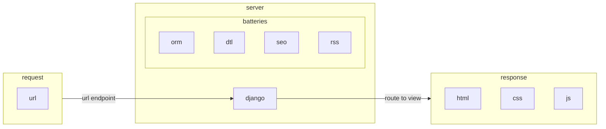

# Request-Response Flow

??? abstract "Django tl;dr"

    It handles :material-call-made: _[request-response](https://en.wikipedia.org/wiki/Request%E2%80%93response)_ :material-call-received: patterns between the client, usually a browser :octicons-browser-16:, and an http server :material-server:

    It sources data from auto-generated `sql` queries, each called a `Queryset`.

    Server-side :material-server: `Views` are templates, built with `html` :material-language-html5:, `css` :simple-css3:, and `js` :material-language-javascript:, rendered via browser :octicons-browser-16: response.

    It goes further by including the kitchen sink, i.e.

    1. `orm-sql` :material-database: for many sql engines
    2. `dtl/jinja` :material-variable-box: templating language,
    3. `seo` :octicons-search-16:
    4. `rss` :material-newspaper:, etc.



## :octicons-browser-16: :material-call-made: request to :material-server:server

We start with a {==url.==}

`runserver` gives us: _http://127.0.0.1:8000/_.

Opening this url in the :octicons-browser-16: browser initiates an :material-call-made:`HttpRequest` to a :material-server:server.

??? info "Dissect Runserver Prompt"

    ```sh title="The Runserver URL" linenums="1" hl_lines="9"
    # This is how a Django project is run locally
    python manage.py runserver
    # Watching for file changes with StatReloader autoreload.
    # Performing system checks...

    # System check identified no issues (0 silenced).
    # March 01, 2023 - 00:00:00
    # Django version 4.2, using settings 'config.settings'
    # Starting development server at http://127.0.0.1:8000/
    # Quit the server with CONTROL-C.
    ```

    Let's parse lines 8 and 9:

    1. `config.settings` implies that, for this particular Django instance, the main _project folder_ is named `config`.
    2. Django's _local development_ server is running at a specific URL: `http://127.0.0.1:8000/`
    3. While this is running, I can type the said URL in a browser and hit enter.
    4. I can expect that a `HttpRequest` will be sent to this running server.
    5. The server _receives_ the request and returns, to the requesting browser, some `html`, `css`, and `js` as an `HttpResponse`.
    6. This pattern is known as the request-response cycle.
    7. Django will now look for an appropriate `urlpattern` route that matches the URL.

In local environments, the :material-server:server is django's `runserver`. In production environments, a popular choice of :material-server:server is [gunicorn](./production-server.md).

## :simple-django: :material-server:server to :material-routes: router + :fontawesome-solid-paint-roller: view

Django {++matches++} the url endpoint to a _developer-defined_ :material-routes:`UrlPattern` route.

What is the endpoint? Well, it's the tip of the url. So the router's matching process goes something like this for url _http://127.0.0.1:8000{++/++}_:

1. :eyes: does the endpoint of _http://127.0.0.1:8000{++/++}_ match {--/about--}? No.
2. :eyes: does the endpoint of _http://127.0.0.1:8000{++/++}_ match {--/contact-us--}? No.
3. :eyes: does the endpoint of _http://127.0.0.1:8000{++/++}_ match {++/++}? __Yes__.

??? info "Dissect URL Routing"

    More technically, if the requested url is _http://127.0.0.1:8000{++/++}_, this represents an empty string `""` following the backslash "_{++/++}_". How do we find the matching pattern in the code?

    If we look inside the `config.settings.base` module, there are many variables but our interest is in:

    ```py title="/config/settings/_settings.py"
    ROOT_URLCONF = "config.urls"
    ```

    This declares Django's routing system to be controlled by a `urls.py` file found in the `config` folder:

    ```py title="See /config/urls.py, the main router" linenums="1" hl_lines="5"
    urlpatterns = [
        ...
        path("accounts/", include("allauth.urls")),
        path("profiles/", include("profiles.urls")),
        path("", TemplateView.as_view(template_name="home.html"), name="home"),
        # match found! in ""
        ...
    ]
    ```

## :material-server:server sends :material-call-received: response containing a :fontawesome-solid-paint-roller: view

The endpoint {++/++} is typically the homepage of the website.

It's up to the developer to construct _how this `View` looks like_, typically by combining `html`, `css`, and `js` with data that is persisted in a database.

So the :material-routes:route to {++/++} represents _a pre-constructed homepage_ `View` :fontawesome-solid-paint-roller:.

??? info "Dissect View Templating"

    Django offers some class-based views to make displaying content simpler. In this case, we're using a minimal `TemplateView` (which inherits from `View`) relying on a certain "home.html". Where do we find this "home.html"?

    In our Django `config.settings.base` module, we determine where to source templates:

    ```py title="Templates Directory" linenums="1" hl_lines="6"
    BASE_DIR = Path(__file__).resolve().parent.parent.parent
    ...
    TEMPLATES = [
        {
            "BACKEND": "django.template.backends.django.DjangoTemplates",
            "DIRS": [BASE_DIR / "templates"],  # added
            "APP_DIRS": True,
            "OPTIONS": {
                ...
            },
        },
    ]
    ```

    ```jinja title="Django Templating Language" linenums="1" hl_lines="1"
     <-- home.html is a partial template, its parents is base.html --->
    
        <h1>Home</h1>
        <article>
            <p>Sample <mark>text</mark> highlighted for illustration.</p>
            <blockquote>This is a blockquote<br>- <cite>Quoting from a random person</cite></blockquote>
            
        </article>
    
    ```

    The content of `home.html` is what the browser will receive as a response. Although this doesn't look like much, it can contain subtemplates as implied by the very first line. If we look at the refernced "base.html" in Line 1,
    we can see the full page of "home.html"

    In the `/templates` directory, we see "home.html" which contains the following content:

    ```jinja title="base.html: see included css, js"
    
    <!DOCTYPE html>
    <html>
        <head>
            <meta charset="utf-8" />
            <meta name="viewport" content="width=device-width, initial-scale=1">
            <meta name="description" content="Sample description "> <!-- # Customize content for search -->
            <title>Test site sample</title> <!-- Enable title changes -->
            
            
                <link rel="stylesheet" href="https://unpkg.com/@picocss/pico@1.*/css/pico.min.css">
                
                
            
        </head>
        <body class="container">
            
            
            
                
                <!-- This is what "home.html" populates -->
                
                
                    <script src="https://unpkg.com/htmx.org@..."></script>
                    <script src="https://unpkg.com/hyperscript.org@..."></script>
                    <script>document.body.addEventListener("htmx:configRequest", (e) => {e.detail.headers["X-CSRFToken"] = "{{ csrf_token }}";});</script>
                    
                    
                
            
        </body>
    </html>
    ```

## Summary

We started with a _requesting_ {==url==} _http://127.0.0.1:8000{++/++}_ and retrieved a viewable _response_.

1. The :octicons-browser-16: {==url==}'s endpoint {++/++} made an :material-call-made:`HttpRequest` to the :material-server:server.
2. :material-server:server pinged :simple-django: :material-routes:routing and it replied with:

    > _"Yes, I have a `View` :fontawesome-solid-paint-roller: representing  :material-call-made:request to endpoint {++/++}"_

3. This `View` :fontawesome-solid-paint-roller: is packaged into a :material-call-received:`HttpResponse` for rendering in the :octicons-browser-16: browser.
4. Since the `View` :fontawesome-solid-paint-roller: will likely contain {==other urls==}... we can expect more :material-call-made: _request-response_ :material-call-received: cycles.
