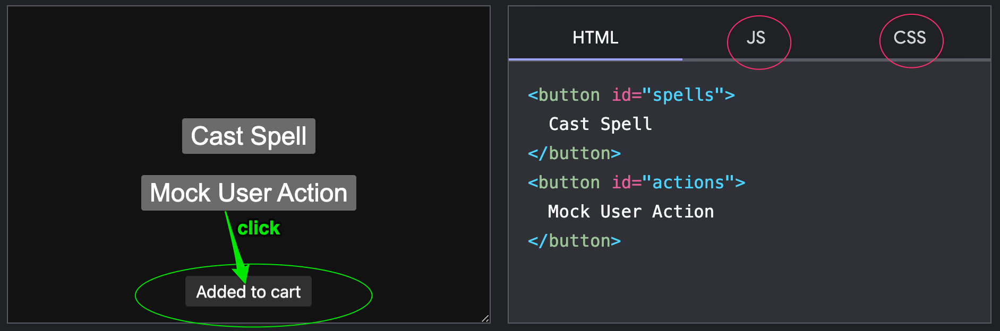

# web.dev Injection

If you have some familiarity with `html`, `css`, and `js`, it's relatively straightforward to apply some [web.dev components](https://web.dev/patterns/components/) into a Django site. [See repo](https://github.com/GoogleChrome/web.dev/tree/main/src/site/content/en/patterns/components) to make it easier to copy/paste.

## Toast



Consider the `Toast` component. In the example highlighted in web.dev, a user clicks on the button and a "toast" appears at the bottom of the viewport.

I could probably study the `css` + `js` involved and see how to implement this myself but since this `Toast` artifact is ready to use, I can just plug it into :simple-django: tooling.

One candidate for toasts would be Django's [messages framework](https://docs.djangoproject.com/en/dev/ref/contrib/messages/) where handy messages like _"You've signed in"_, _"You've logged out"_ can appear whenever such message appears in a View.

How do we go about this?

In the screenshot above, the left side shows the demo, the right side depicts the blueprint for replicating the `Toast` component via:

1. {==Toast HTML panel==}
2. {==Toast CSS panel==}
3. {==Toast JS panel==}

## `/static/css/toast.css`

`cd static/css && touch toast.css`, copy/paste {==Toast CSS panel content==} to `toast.css`, save.

Whenever we use want to use these css styles in a Django html template, we simply add the `toast.css` file as a css reference:

```html title="Add css to html" linenums="1" hl_lines="1 9"
   <!-- static refers to STATIC_URL in config.settings.base --->
  <!DOCTYPE html>
  <html>
    <head>
      <meta charset="utf-8" />
      <meta name="viewport" content="width=device-width, initial-scale=1">
      ...
      <!-- we can use static as shortcut to /static/css/toast.css --->
      <link rel="stylesheet" href="">
    </head>
    ...
    <body>
    ...
    </body>
    ...
  </html>
```

## Copy Toast web.dev JS to `/static/js/toast.js`

`cd static/js && touch toast.js`, copy/paste {==Toast JS panel content==} to `toast.js`, save.

Add the `toast.js` file as a js reference, make spresent whenever `toast.css` appears:

```html title="Add js to html" linenums="1" hl_lines="8 16"
  
  <!DOCTYPE html>
  <html>
    <head>
      <meta charset="utf-8" />
      <meta name="viewport" content="width=device-width, initial-scale=1">
      ...
      <link rel="stylesheet" href="">
    </head>
    ...
    <body>
    ...
    </body>
    ...
    <!-- note the crucial "type:module" in both scripts --->
    <script type="module" src=""></script>
    <script type="module">
        import Toast from ""
        
            
                Toast('{{message}}')
            
        
    </script>
  </html>
```

Admittedly, this requires some understanding of how both `toast.js` and the :simple-django: templating language (`dtl`) works.

If we look at `toast.js` file, we can see that it involves the export of a `Toast` component, this
component being displayed and removed in the DOM via javascript functions `createToast`, `addToast`, and `Toaster.removeChild`.

Since this is more or less what we need, we simply wrap this around the `forloop`, a :simple-django: [built-in tag](https://docs.djangoproject.com/en/dev/ref/templates/builtins/#for), so that each message in the `View` goes through the javascript functions outlined above.

## Run collectstatic

Add the newly created `toast.css` and `toast.js` files into the `/staticfiles` folder via the management command `collectstatic`:

```sh
python manage.py collectstatic --no-input
```
