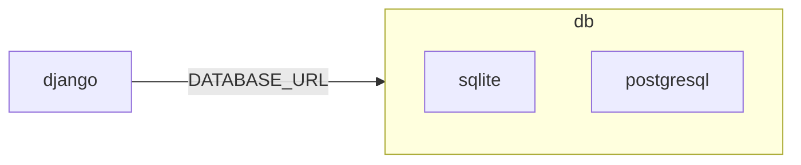

# Setup Local Environment Variables

During development I'll likely end up with a bunch of third-party secrets. The `.env` file with plaintext `KEY=VALUE` formatting is the traditional source of truth for these sensitive artifacts but these won't be saved to the repository, prompting the need for local secrets management.

## Django

### `ENV_NAME`

default: `dev`, may be either `dev`, `test`, or `prod`.

Toggles the settings to use as employed in various environments:

1. local dev
2. `fly.toml`
3. `compose.yml`

### `DJANGO_DEBUG`

default: not set; intended to override [`DEBUG`](https://docs.djangoproject.com/en/dev/ref/settings/#debug) in settings.

env | state
--:|:--
`dev` | Always `True`
`test` | default: `False`, but overrideable via `DJANGO_DEBUG`.
`prod` | Always `False`

### `DJANGO_SECRET_KEY`

default: random; must be explicitly set in `test` and `prod` environments.

This is what populates :simple-django: [`SECRET_KEY`](https://docs.djangoproject.com/en/dev/ref/settings/#std-setting-SECRET_KEY).

Copy/paste the following snippet to generate your key in the console.

```sh title="Generates key from command line."
python -c 'from django.core.management.utils import get_random_secret_key; print(get_random_secret_key())'
```

Add the generated value to the .env file:

```sh title="/.env"
DJANGO_SECRET_KEY="key-generated-with-random-characters" # (1)
```

1. Must enclose in double quotes to prevent escaping characters.

### `DJANGO_ALLOWED_HOSTS`

This is what populates :simple-django: [`ALLOWED_HOSTS`](https://docs.djangoproject.com/en/dev/ref/settings/#allowed-hosts).

### `DJANGO_CSRF_TRUSTED_ORIGINS`

Set this in test / production environments to set [`CSRF_TRUSTED_ORIGINS`](https://docs.djangoproject.com/en/dev/ref/settings/#csrf-trusted-origins)

## Database

### `DATABASE_URL`

!!! warning "Settings Modified"

    TLDR: if the connection string `DATABASE_URL` is _sqlite-like_ use this engine `django.db.backends.sqlite3`;
    otherwise, use this engine: `django.db.backends.postgresql`

#### Overview

This environment variable is adopted by convention even if it doesn't appear anywhere in the official Django documentation (as of Django 4.2).

It refers to the _connection_ of the server (handling the request-response cycle involving `html`, `css`, and `js`) to a database management system which in turn is governed by `sql`.



Django supports many database engines but I prefer one of two: sqlite and postgresql.

```toml
[tool.poetry.dependencies]
...
dj-database-url = "^0.5.0" # Necessary dependency
...
```

#### Conventions

The URL is a connection string with [specific conventions](https://github.com/jazzband/dj-database-url#url-schema) applied by Jazzband's `dj_database_url` library. Listed here are the formats necessary for sqlite and postgresql:

Engine | Django Backend | Database URL Format
:--:|:--:|:--:
postgres | `django.db.backends.postgresql` | postgres://`USER`:`PASSWORD`@`HOST`:`PORT`/`NAME`
sqlite | `django.db.backends.sqlite3` | sqlite:///`PATH`

#### Custom function

```py title="config/settings/_settings.py" linenums="1" hl_lines="1 10"
def add_postgres_or_sqlite(setting: dict) -> dict:
    if name := setting.get("NAME"):
        if name.endswith(".db") or name.endswith(".sqlite"):
            return setting | {"ENGINE": "django.db.backends.sqlite3"}
    return setting | {
        "ENGINE": "django.db.backends.postgresql",
        "OPTIONS": {"connect_timeout": 5},
    }
DATABASES = {
    "default": add_postgres_or_sqlite(
        env.dj_db_url("DATABASE_URL", "sqlite:///db.sqlite")
    )
}
```

## Email

### `EMAIL_RECIPIENT`

The boilerplate contains a `pages` app which hosts a contact form. This form enables the visitor to submit a message whichi is emailed to the address contained in `EMAIL_RECIPIENT`. If this is not set, a placeholder is provided but this will not be sufficient when `ENV_NAME` is either `test` or `prod`.

```sh title="/.env" linenums="1" hl_lines="2"
DJANGO_SECRET_KEY="key-generated-with-random-characters"
EMAIL_RECIPIENT="your@emailaddress.com"
```

### `EMAIL_SENDER`

The boilerplate makes use of transactional emails by virtue of `django-allauth` and `django.core.email.send_mail()`. When `ENV_NAME` is _test_ or _prod_, a valid email sender implies a pre-configured email server. I've already setup an email address that is verified by Postmark to handle the same. If this is not set, a placeholder is provided but this will not be sufficient when `ENV_NAME` is either `test` or `prod`.

```sh title="/.env" linenums="1" hl_lines="3"
DJANGO_SECRET_KEY="key-generated-with-random-characters"
EMAIL_RECIPIENT="your@emailaddress.com"
EMAIL_SENDER="bot@somesite.com"
```

### `DEFAULT_FROM_EMAIL`

Affects the way the email address from the sender is viewed when using Postmark.

When passing .env containing a space, e.g. "start-django <donotreply@mv3.dev>" use double quotes
