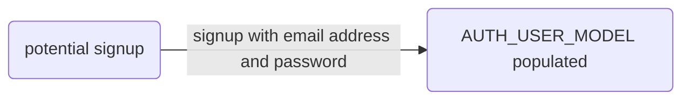

# Email Authentication



This boilerplate adopts the following [allauth](https://django-allauth.readthedocs.io/en/latest/configuration.html) settings:

```py title="/config/settings/_auth.py"
...
"""Authentication will be by email vs. username"""
ACCOUNT_EMAIL_REQUIRED = True # (1)
ACCOUNT_USERNAME_REQUIRED = False # (2)
ACCOUNT_AUTHENTICATION_METHOD = "email" # (3)
ACCOUNT_EMAIL_VERIFICATION = "mandatory" # (4)

"""Authentication protocol"""
ACCOUNT_SIGNUP_PASSWORD_ENTER_TWICE = False
ACCOUNT_EMAIL_CONFIRMATION_EXPIRE_DAYS = 1
ACCOUNT_EMAIL_SUBJECT_PREFIX = "" # (5)
ACCOUNT_LOGIN_ATTEMPTS_TIMEOUT = 86400 # (6)
ACCOUNT_LOGIN_ATTEMPTS_LIMIT = 5
ACCOUNT_LOGOUT_ON_GET = True # (7)
ACCOUNT_EMAIL_CONFIRMATION_AUTHENTICATED_REDIRECT_URL = "account_email" # (8)

LOGIN_REDIRECT_URL = "profiles:settings" # (9)
```

1. The user is required to hand over an e-mail address when signing up.
2. The user is required to enter a username when signing up. Note that the user will be asked to do so even if ACCOUNT_AUTHENTICATION_METHOD is set to email. Set to False when you do not wish to prompt the user to enter a username.
3. Specifies the login method to use – whether the user logs in by entering their username, e-mail address, or either one of both. Setting this to "email" requires ACCOUNT_EMAIL_REQUIRED=True/
4. Determines the e-mail verification method during signup – choose one of "mandatory", "optional", or "none". Setting this to “mandatory” requires ACCOUNT_EMAIL_REQUIRED to be True. When set to “mandatory” the user is blocked from logging in until the email address is verified.
5. Instead of using `[Site]:` in the subject, remove it by replacing the prefix to an empty string `""`"""
6. 86400 seconds = 1 day
7. User does not need to confirm logout on click.
8. When user is already logged in and adds an email address to his profile, redirect to _django-allauth_'s email settings' reverse URL.
9. On login, redirect to profile settings' reverse URL.
