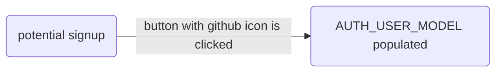

# Social Authentication



## Overview

Social auth is also built-in, courtesty of _django-allauth_.

For instance, users who choose Github login to the local address `127.0.0.1` will be prompted with a Github consent form.

The callback function, generated in Github, will allow Github users to be authenticated _without having to submit a username and password_.

## Settings

This boilerplate also adopts the following [allauth](https://django-allauth.readthedocs.io/en/latest/configuration.html) settings with respect social authentication providers:

```py title="/config/settings/_auth.py"
SOCIALACCOUNT_EMAIL_VERIFICATION = "none" # (1)
SOCIALACCOUNT_AUTO_SIGNUP = False # (2)
SOCIALACCOUNT_PROVIDERS = { # (3)
    "google": {
        "APP": {
            "client_id": env("GOOGLE_ID", None),
            "secret": env("GOOGLE_KEY", None),
        }
    },
    "github": {
        "APP": {
            "client_id": env("GITHUB_ID", None),
            "secret": env("GITHUB_KEY", None),
            "key": "",
        }
    },
}
```

1. Prevent email verification if auth is by social
2. Although email verifification is not required, can prevent bypass and still require the user to consent to terms / conditions before signing up.
3. I've already preconfigured Github and Google to use a local address `127.0.0.1` with my credentials but see the section on Contexts.

To add a _social provider_ to each _live_ Django site, I'll need to
do a few things:

1. The desired social provider has been added to both `SOCIALACCOUNT_PROVIDERS` and `INSTALLED_APPS`.
2. Environment variables containing specific credentials match the requesting environment's user request.
3. The `callback url` based on [allauth template](https://django-allauth.readthedocs.io/en/latest/providers.html#providers) is working.

In order to get these credentials, an application must be made in the provider's website. See specific details for:

1. [Github](./auth-github.md)
2. [Google](./auth-google.md)

## Context

context | url  | purpose | reusable | `ENV_NAME`
:--:|:--:|:--|:--|:--
local | http://`127.0.0.1`:8000 | does it work? | yes | `dev`
container | http://`0.0.0.0`:8080 | does it work? | yes | `test`
start-django | https://start-django.fly.dev (or `http://`) | limited, ideally for secured (`https`) use only by designated url | no | `prod`

## Reusability

In each of these environments, I'll need to secure key-value pairs to authenticate via _Github_, _Google_, _Facebook_, _Apple_, _Telegram_ or whatever service that employs oAuth.

Note the first two environments will be reusable for whatever website I'll develop with Django (or whatever framework, in whatever language, really) since this is really just my machine accessing the service using the declared urls.

The third environment's url will only be useful in https://start-django.fly.dev.

## Issuance

django-allauth [instructs](https://django-allauth.readthedocs.io/en/latest/providers.html):

> Most providers require you to sign up for a so called API client or app, containing a client ID and API secret. You must add a SocialApp record per provider via the Django admin containing these app credentials.

I like to add the record via `.env` so that I can programatically reuse them rather than having to manually access the Django admin, adding a record per provider.

Before I'm able to use this record however, I need to get issued a key-value pair and each provider has its own process of issuing secrets:

[Github :material-github:](../setup/auth-github.md){ .md-button }
[Google :material-google:](../setup/auth-google.md){ .md-button }
[Facebook :material-facebook:](../setup/auth-fb.md){ .md-button }

## Storage

Once a provider issues a key-value pair in the form of:

```sh title="Replace service_name with google, github, etc."
<service_name>_id=the-id-supplied-by-service
<service_name>_secret=the-secret-issued-based-on-id-above
```

... I should be able to store the pair for use but this carries inherent risks.

Let's say the future social media giant [Mastodon](https://joinmastodon.org/) decides to become an oAuth Provider and is able to give me an `id` and `secret` for my website so I can create a _Login with Mastodon_ button.

How do I go about storing these fields for future use? The `.env` file in the root directory would be the most likely storage file.

=== "Using plain-text"

    This "plain-text method", copy/pasting secrets into `.env` files, is a de facto practice absent a "best practice" system where developers can specify snippets for their apps / databases / websites from a secure location.

      environment | `mastodon_id` | `mastodon_secret`
      :--:|:--:|:--:
      local | id-supplied-for-`127.0.0.1` | secret-id-of-`127.0.0.1`
      container | id-supplied-for-`0.0.0.0` | secret-id-of-`0.0.0.0`
      site | id-supplied-for-`start-django.fly.dev` | secret-id-of-`start-django.fly.dev`


    It's simpler to run a container with an `.env` file populated with plain-text:

    ```sh
    docker-compose -f ./src/scripts/sq/compose.sq.yml up --build
    ```

    This [compose.sq.yml](https://docs.docker.com/compose/environment-variables/envvars/#compose_file) should
    make reference to the `env_file` key:

    ```yaml title="/src/scripts/sq/compose.sq.yml" linenums="1" hl_lines="5"
    services:
      redis_db:
        ...
      sq_web:
        env_file: .env # must supply plain-text secrets in the root
        build:
          context: .
          dockerfile: ./src/scripts/sq/Dockerfile
    ```

=== "Using secret references"

    I'm a 1Password subscriber and I like that I'm able to use [secret references](https://developer.1password.com/docs/cli/secret-references) as an add-on to their main service. So what I store in my .env file is not the token itself but rather a reference to the token:

      environment | `mastodon_id`   | `mastodon_secret`
      :--:|:--:|:--:
      local | op://dev/auth-`local`/mastodon_client/`id` | op://dev/auth-`local`/mastodon_client/`secret`
      container | op://dev/auth-`container`/mastodon_client/`id` | op://dev/auth-`container`/mastodon_client/`secret`
      start-django | op://dev/`<site>`/mastodon_client/`id` | op://dev/`<site>`/mastodon_client/`secret`

    Where are the tokens actually stored? In the 1Password client residing in the device. So when I run a management command requiring the use of these secrets, I'd do so via:

    === ":fontawesome-solid-person-walking-luggage:"

        ```sh title="Terminal"
        op run --env-file="../.env" python manage.py runserver_plus
        ```

    === "Shortcut :material-run-fast:"

        ```sh title="Terminal"
        just orun
        ```

    There is more complexity involved, certainly, but with the upside of guarding against:

    1. storing plain-text secrets residing in my machine
    2. accidentally committing these to the repository, and
    3. risks attendant in either of these cases.

    Unfortunately, using `op run` to run a container [doesn't work](https://github.com/justmars/start-django/issues/1#issue-1682980769):

    ```sh title="Will not work"
    cd src && op run --env-file="../.env"  docker-compose --profile sq up --build
    ```

    It's necessary to employ an "injection" mechanism using a template file:

    ```sh title="Will work"
    op inject -i ./src/scripts/sq/compose.yml.tpl -o compose.yml
    docker-compose up --build
    ```
