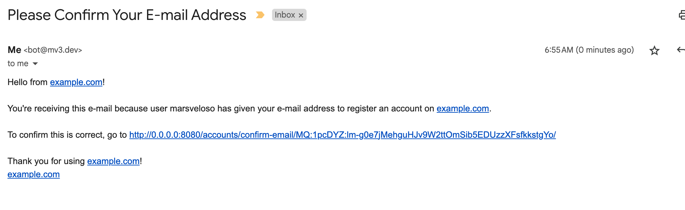

# Transactional Emails

!!! warning "Postmark is a Paid Service"

    [With]((https://postmarkapp.com/pricing)) _100 emails / month_ as their free tier, however, this is suitable for testing purposes. Afterwards, when the app starts receiving traction, pricing starts at $15/month for up to _10k emails sent/received_.

## Email Backend

How do I send emails to the user when the following transactions happen?

1. _verify email address_ on signup; or
2. _reset password_ in case it's been forgotten?

=== "`dev` default"

    In development mode, I use Django's email server at `django.core.mail` for handling transactional emails so that the email is served on the terminal rather than an smtp server: This is the import of the following line in `config.settings`:

    ```py title="/config/settings/_auth.py"
    EMAIL_BACKEND = "django.core.mail.backends.console.EmailBackend" # (1)
    ```

    1. The :simple-django: [default](https://docs.djangoproject.com/en/dev/ref/settings/#email-backend) is `"django.core.mail.backends.smtp.EmailBackend"`. This is considered the [console backend](https://docs.djangoproject.com/en/dev/topics/email/#console-backend). It will also be overriden, depending on `POSTMARK_API_KEY` in `settings/__init__.py`"""

    To guard against unset email servers in non-dev environments, I create the following some non-default env variables and check if they've been set by the user.

    ```py title="Ensures that test/prod values are set."
    # in /config/settings/_auth.py
    _email = "do@configure.separately"  # (1)
    EMAIL_RECIPIENT = env("EMAIL_RECIPIENT", _email)  # (2)
    EMAIL_SENDER = env("EMAIL_SENDER", _email)  # (3)
    EMAIL_NOT_CONFIGURED = None  # If populated by criteria, use as error message.
    if not all([_email != EMAIL_RECIPIENT, _email != EMAIL_SENDER]):
        EMAIL_NOT_CONFIGURED = (f"{EMAIL_SENDER=} and {EMAIL_RECIPIENT=} must be configured.")
    # in /config/settings/__init__.py
    if ENV_NAME in ["prod", "test"]:
      ...
      if POSTMARK_API_KEY: #
          EMAIL_BACKEND = "postmark.django_backend.EmailBackend"  # (4)
          if EMAIL_NOT_CONFIGURED:
              raise EnvError(EMAIL_NOT_CONFIGURED)
    ```

    1. Placeholder for next 2 variables to ensure that this gets replaced, see related `EMAIL_NOT_CONFIGURED`.
    2. Needed by contact form in pages/tasks.py, see `background_send_contact_form_email()`
    3. Transactional emails require a separate email server setup.
    4. Notice how this overrides the original setting in `dev`

=== "`test`/`prod`"

    In contrast, when `ENV_NAME` is `test`/`prod`, a proper email server like _Sendgrid_, _Postmark_, _Mailgun_, _Amazon SES_ etc. will need to be setup. For now, I'll use Postmark.

    ```py title="/config/settings/__init__.py" linenums="1" hl_lines="1 4"
    from ._auth import * # EMAIL_BACKEND will be overriden
    if ENV_NAME in ["prod", "test"]:
      if POSTMARK_API_KEY:
        EMAIL_BACKEND = "postmark.django_backend.EmailBackend"  # override
        if EMAIL_NOT_CONFIGURED:
            raise EnvError(EMAIL_NOT_CONFIGURED)
    ```

## Postmark Setup

Ensure setup in the postmark web [app](https://postmarkapp.com/) before proceeding. This requires a Postmark account and a previously acquired _domain name_, e.g. `mv3.dev` is a domain name. General steps to follow:

1. Postmark requires to add the domain.
2. `DKIM` and `Return-Path` DNS records will be revealed afterwards. It will look something like this:

    Hostname | Type | Value
    :--:|:--:|:--:
    DKIM        | xxxxxx.\_domainkey | TXT   | xxxxx
    Return-Path | pm-bounces         | CNAME | xxxxx

3. These records will need to be inputted in the domain registrar, e.g. Google, Cloudflare, Namecheap, etc.
4. I'll need to set these records from Postmark... in Namecheap since this is where I registered the domain.
5. After setup in Namecheap, I revisit Postmark and in each of the records, click _verify_.
6. After everything passes, generate `POSTMARK_API_KEY` from the dashboard, e.g. `xxx`, and add it to the `.env` file:

=== "Using plain-text"

    ```sh title="Values are stored in raw text format"
    POSTMARK_API_KEY=i-am-the-secret
    EMAIL_RECIPIENT=i-can-be-any-forwardable-email-address
    EMAIL_SENDER=i-need-to-configured-as-a-sender-in-postmark

    # This additional configuration is already set in /_auth.py, see https://github.com/themartorana/python-postmark#django
    POSTMARK_SENDER = EMAIL_SENDER # (1)
    POSTMARK_TEST_MODE = False
    POSTMARK_TRACK_OPENS = True
    POSTMARK_RETURN_MESSAGE_ID = True
    DEFAULT_FROM_EMAIL = EMAIL_SENDER # (2)
    ```

    1. Seeming duplication is intentional. In the event, I use Postmark, I just need to set `POSTMARK_SENDER`. If I need to switch to a different provider, I still retain the same logic for `EMAIL_SENDER`.
    2. Overrides default `webmaster@localhost`; without it, when running Postmark, results in `Unprocessable Entity: Invalid 'From' address: 'webmaster@localhost'.`

=== "Using secret references"

    ```sh title="Actual values are stored in 1password"
    POSTMARK_API_KEY=op://dev/postmark/credential
    EMAIL_RECIPIENT=op://dev/start-django/email/recipient
    EMAIL_SENDER=op://dev/start-django/email/sender
    ```

    See same discussion on secret references in Social Auth [setup](./auth-social.md#storage).

## Test Configuration

1. Add .env vars: `ENV_NAME=test` and `POSTMARK_API_KEY=xxx`
2. Run `docker-compose --env-file .env up --build`
3. Login via regular _email address_ and _password_
4. Check that email has been received
5. Note that without formatting, the email will look barren:

    
6. Email markup in 2023 is still a headache. Consider notes from [Cerberus templates](https://www.cerberusemail.com/), [Maizzle](https://maizzle.com/docs/introduction), etc.
